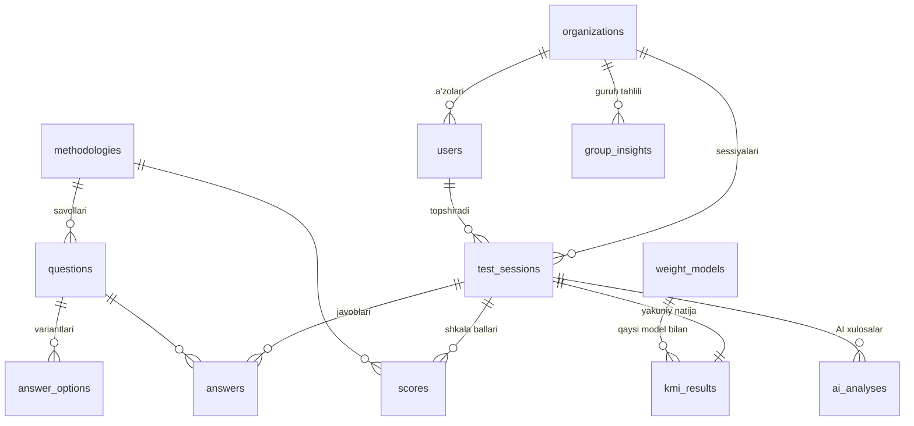

# KMI Tizimi — Papka va Ma'lumotlar Bazasi Arxitekturasi

> **Loyiha:** "Talabalarning kasbiy motivatsiyasini sun'iy intellekt asosida baholash va prognozlash tizimi"
>
> Ushbu hujjat loyiha hujjatidagi 4 modul (ma'lumot kiritish, indeks hisoblash, AI modeli, natija) va patent yangiliklari (metodikalar integratsiyasi, adaptiv og'irlik algoritmi, prognozlash, avtomatik interpretatsiya) asosida tuzilgan.

---

## 1. Umumiy arxitektura

```
┌─────────────┐     REST API      ┌──────────────┐     ┌──────────────┐
│  Frontend    │ ◄──────────────► │   Backend     │ ◄──► │  PostgreSQL   │
│  Vue 3+Vite  │                  │   FastAPI     │     │  (ma'lumotlar)│
└─────────────┘                  └──────┬───────┘     └──────────────┘
                                        │
                                        ▼
                                 ┌──────────────┐
                                 │ Anthropic API │  (AI interpretatsiya)
                                 └──────────────┘
```

- **Frontend** — Vue 3 (SPA): test topshirish, natija ko'rish, admin panel.
- **Backend** — FastAPI: hisoblash mantiqi, AI chaqiruvi (API kalit serverda saqlanadi), autentifikatsiya.
- **Baza** — PostgreSQL: relyatsion ma'lumotlar (savollar, javoblar, natijalar) uchun eng mos tanlov.

> Muhim printsip: **KMI hisoblash va og'irliklar faqat backendda**. Frontend hech qachon o'zi hisoblamaydi — bu patentdagi "yagona matematik model" da'vosini himoya qiladi va natijalarni soxtalashtirishdan saqlaydi.

---

## 2. Papka (folder) strukturasi

Monorepo — bitta repoda frontend va backend:

```
ksi/
├── frontend/                      # Vue 3 + Vite (SPA)
│   ├── public/
│   ├── src/
│   │   ├── api/                   # Backend bilan aloqa (axios klient)
│   │   │   ├── client.js
│   │   │   ├── sessions.js        # test sessiyalari
│   │   │   ├── results.js
│   │   │   └── admin.js
│   │   ├── assets/                # CSS, shriftlar, rasmlar
│   │   ├── components/
│   │   │   ├── common/            # AppButton, AppModal, AppToast, ChartCard
│   │   │   ├── quiz/              # DemographicForm, QuestionBlock, ProgressBar
│   │   │   ├── result/            # ScoreHero, DonutChart, RadarProfile,
│   │   │   │                      # RiskCard, AiAnalysis, CareerGrid
│   │   │   └── admin/             # KpiRow, ResultsTable, HistogramChart,
│   │   │                          # AiInsights, ExportButton
│   │   ├── views/                 # Sahifalar
│   │   │   ├── LandingView.vue
│   │   │   ├── QuizView.vue
│   │   │   ├── ResultView.vue
│   │   │   ├── AdminView.vue
│   │   │   └── LoginView.vue
│   │   ├── stores/                # Pinia (holat boshqaruvi)
│   │   │   ├── quiz.js            # javoblar, qadamlar
│   │   │   ├── auth.js
│   │   │   └── admin.js
│   │   ├── router/index.js
│   │   ├── utils/
│   │   └── main.js
│   ├── index.html
│   ├── package.json
│   └── vite.config.js
│
├── backend/                       # FastAPI (spss-in-uzbek-backend uslubida)
│   ├── app/
│   │   ├── main.py
│   │   ├── core/                  # config.py, security.py (JWT),
│   │   │                          # logging.py, errors.py
│   │   ├── db/                    # session.py, base.py
│   │   ├── models/                # SQLAlchemy ORM modellar (3-bo'limga qarang)
│   │   ├── schemas/               # Pydantic sxemalar (request/response)
│   │   ├── routers/               # API endpointlar
│   │   │   ├── auth.py            # login, ro'yxatdan o'tish
│   │   │   ├── methodologies.py   # savollar ro'yxati
│   │   │   ├── sessions.py        # test boshlash / javob yuborish / yakunlash
│   │   │   ├── results.py         # natija olish, PDF/ulashish
│   │   │   ├── admin.py           # KPI, jadval, CSV eksport, guruh statistikasi
│   │   │   └── ai.py              # AI tahlil (individual va guruh)
│   │   ├── scoring/               # ⭐ Patent yadrosi — matematik model
│   │   │   ├── zamfir.py          # M₁: IM / TIM / TSM indekslari
│   │   │   ├── golomshtok.py      # M₂: qiziqishlar xaritasi
│   │   │   ├── rokich.py          # M₃: qadriyatlar indeksi
│   │   │   ├── integrative.py     # M₄: qo'shimcha ko'rsatkich, risk
│   │   │   ├── weights.py         # ⭐ adaptiv og'irlik algoritmi (w₁..w₄)
│   │   │   └── kmi.py             # KMI = Σ(wᵢMᵢ)/Σw, tip va risk zonasi
│   │   └── services/
│   │       ├── ai_service.py      # Anthropic API (interpretatsiya)
│   │       ├── prediction.py      # prognozlash modeli (ML, keyingi bosqich)
│   │       └── export_service.py  # CSV / PDF
│   ├── alembic/                   # baza migratsiyalari
│   ├── tests/                     # pytest: ayniqsa scoring/ uchun
│   ├── requirements.txt
│   ├── .env.example               # DATABASE_URL, ANTHROPIC_API_KEY, JWT_SECRET
│   └── Dockerfile
│
├── legacy/                        # hozirgi index.html — demo/patent ilovasi
│   └── index.html
├── docs/
│   ├── ARCHITECTURE.md            # ushbu hujjat
│   └── FORMULAS.md                # metodikalar va KMI formulalari tavsifi
├── docker-compose.yml             # postgres + backend + frontend (dev)
└── README.md
```

**Mantiq:** hujjatdagi 4 modul kodda aniq aks etadi —

| Hujjatdagi modul | Kodda joyi |
|---|---|
| 1. Ma'lumot kiritish | `frontend/views/QuizView` + `routers/sessions.py` |
| 2. Indeks hisoblash | `backend/app/scoring/` (zamfir, golomshtok, rokich, integrative) |
| 3. AI modeli | `scoring/weights.py` + `services/prediction.py` + `services/ai_service.py` |
| 4. Natija | `frontend/views/ResultView` + `routers/results.py` |

---

## 3. Ma'lumotlar bazasi arxitekturasi (PostgreSQL)

### ER diagramma



### Jadvallar

**`organizations`** — universitetlar, markazlar, HR bo'limlar (tijorat salohiyati uchun ko'p-ijarachi/multi-tenant asos)

| ustun | turi | izoh |
|---|---|---|
| id | uuid PK | |
| name | text | "TDPU", "Karyera markazi" |
| org_type | text | university / center / hr / other |
| created_at | timestamptz | |

**`users`** — tizim foydalanuvchilari

| ustun | turi | izoh |
|---|---|---|
| id | uuid PK | |
| org_id | uuid FK → organizations | null = mustaqil foydalanuvchi |
| role | text | `admin` / `expert` (psixolog) / `respondent` |
| full_name | text | |
| email | text unique | yoki telefon |
| password_hash | text | |
| created_at | timestamptz | |

**`methodologies`** — metodikalar katalogi (kengaytiriladigan: yangi metodika = yangi qator, kod o'zgarmaydi)

| ustun | turi | izoh |
|---|---|---|
| id | int PK | |
| code | text unique | `zamfir` / `golomshtok` / `rokich` / `integrative` |
| name | text | |
| weight_symbol | text | M₁..M₄ |
| version | int | savollar o'zgarsa versiya oshadi |
| is_active | bool | |

**`questions`** — savollar (kodda emas, bazada — tahrirlash uchun admin panel yetadi)

| ustun | turi | izoh |
|---|---|---|
| id | int PK | |
| methodology_id | int FK | |
| order_num | int | |
| text | text | |
| subscale | text | zamfir: `IM`/`TIM`/`TSM`; rokich: `terminal`/`instrumental`; golomshtok: soha kodi |
| is_reverse | bool | teskari ball (masalan, "qiyin vazifadan qochaman") |
| is_active | bool | |

**`answer_options`** — javob variantlari (Likert 1–5 yoki Golomshtok uchun `+`/`0`/`−`)

| ustun | turi | izoh |
|---|---|---|
| id | int PK | |
| question_id | int FK | |
| value | int | ball qiymati |
| label | text | "To'liq mos keladi" |

**`test_sessions`** — bitta topshirish jarayoni (hujjatdagi "ma'lumot kiritish moduli")

| ustun | turi | izoh |
|---|---|---|
| id | uuid PK | |
| user_id | uuid FK null | anonim topshirish mumkin |
| org_id | uuid FK null | |
| status | text | `in_progress` / `completed` / `abandoned` |
| full_name | text | anonim bo'lsa ham ism |
| age | int | demografik blok |
| gender | text | |
| course | text | 1-kurs … doktorant |
| direction | text | mutaxassislik |
| institution | text | |
| academic_score | numeric null | akademik natija (GPA/o'zlashtirish %) — hujjatdagi 3-kirish |
| started_at / finished_at | timestamptz | |

**`answers`** — har bir savolga javob

| ustun | turi | izoh |
|---|---|---|
| id | bigint PK | |
| session_id | uuid FK | |
| question_id | int FK | |
| value | int | tanlangan ball |
| answered_at | timestamptz | |
| | | UNIQUE(session_id, question_id) |

**`scores`** — metodika/shkala kesimidagi oraliq indekslar (hujjatdagi "indeks hisoblash moduli")

| ustun | turi | izoh |
|---|---|---|
| id | bigint PK | |
| session_id | uuid FK | |
| methodology_id | int FK | |
| subscale | text | `IM`, `TIM`, `TSM`, `terminal`, soha kodi… |
| raw_score | numeric | xom ball |
| normalized | numeric | 0–100 normallashtirilgan |

**`weight_models`** — ⭐ adaptiv og'irliklar versiyalari (patentdagi "AI tomonidan hisoblangan w")

| ustun | turi | izoh |
|---|---|---|
| id | int PK | |
| version | text | `v1-static`, `v2-regression`, `v3-rf` |
| algorithm | text | `static` / `regression` / `random_forest` |
| weights | jsonb | `{"w1":0.30,"w2":0.15,"w3":0.25,"w4":0.30}` |
| metrics | jsonb | aniqlik ko'rsatkichlari (o'qitilgandan keyin) |
| trained_at | timestamptz | |
| is_active | bool | ayni paytda faqat bittasi faol |

> Boshlanish: `static` versiya (hozirgi qo'lda berilgan og'irliklar). Ma'lumot to'plangach regressiya/Random Forest bilan qayta o'qitiladi — har bir natija qaysi model bilan hisoblangani saqlanadi, bu ilmiy takrorlanuvchanlik (reproducibility) uchun shart.

**`kmi_results`** — yakuniy natija (hujjatdagi "natija moduli")

| ustun | turi | izoh |
|---|---|---|
| id | uuid PK | |
| session_id | uuid FK unique | 1 sessiya = 1 natija |
| weight_model_id | int FK | qaysi og'irliklar bilan |
| m1 / m2 / m3 / m4 | numeric | Zamfir / Golomshtok / Rokich / qo'shimcha |
| kmi | numeric | 0–100 integrativ indeks |
| motivation_type | text | `intrinsic` / `mixed` / `extrinsic` |
| risk_level | text | `low` / `medium` / `high` |
| prediction | jsonb null | kasbiy yo'nalish prognozi (keyingi bosqich) |
| created_at | timestamptz | |

**`ai_analyses`** — AI interpretatsiyalar (individual va guruh)

| ustun | turi | izoh |
|---|---|---|
| id | uuid PK | |
| session_id | uuid FK null | null = guruh tahlili |
| org_id | uuid FK null | guruh tahlili uchun |
| scope | text | `individual` / `group` |
| model | text | `claude-sonnet-5` |
| content | text | tayyor matn (keshlash — qayta so'ralganda API chaqirilmaydi) |
| created_at | timestamptz | |

**`group_insights`** — admin panel uchun davriy guruh statistikasi (ixtiyoriy, keshlash)

| ustun | turi | izoh |
|---|---|---|
| id | uuid PK | |
| org_id | uuid FK | |
| stats | jsonb | o'rtacha KMI, taqsimot, risk soni |
| period_start / period_end | date | |

### Indekslar

```sql
CREATE INDEX idx_sessions_org      ON test_sessions(org_id, finished_at);
CREATE INDEX idx_answers_session   ON answers(session_id);
CREATE INDEX idx_scores_session    ON scores(session_id);
CREATE INDEX idx_results_kmi       ON kmi_results(kmi);
CREATE INDEX idx_results_risk      ON kmi_results(risk_level);
```

---

## 4. Asosiy oqim (data flow)

```
1. POST /sessions              → sessiya ochiladi (demografik ma'lumotlar)
2. GET  /methodologies         → faol savollar ro'yxati (4 metodika)
3. POST /sessions/{id}/answers → javoblar bosqichma-bosqich saqlanadi
4. POST /sessions/{id}/finish  → backend:
     a. scoring/zamfir|golomshtok|rokich|integrative → scores jadvali
     b. scoring/weights (faol weight_model)          → w₁..w₄
     c. scoring/kmi → KMI, tip, risk                 → kmi_results
     d. services/ai_service → Claude interpretatsiya  → ai_analyses
5. GET  /results/{session_id}  → frontend natijani chizadi
6. Admin: GET /admin/kpi, /admin/results, /admin/insights, /admin/export.csv
```

---

## 5. Bosqichma-bosqich joriy etish rejasi

1. **Bosqich 1** — backend skeleti + baza + `static` og'irlikli KMI (hozirgi formulani ko'chirish), Golomshtok savollarini qo'shish.
2. **Bosqich 2** — Vue frontend (hozirgi dizaynni komponentlarga ko'chirish), AI interpretatsiya backend orqali.
3. **Bosqich 3** — ma'lumot to'plangach: adaptiv og'irliklar (regressiya → Random Forest), prognozlash moduli, guvohnoma/patent uchun hujjatlash.
